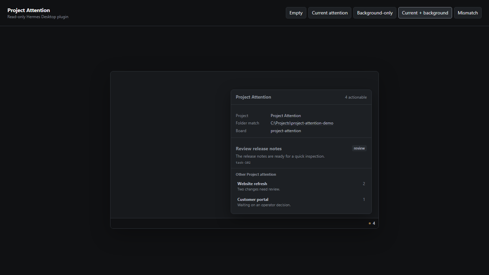

# Project Attention

A small, removable, read-only Hermes Desktop plugin that connects native Projects, their bound workspace folders and stock Kanban boards, and exact stored sessions.

Project Attention stays invisible when everything is clear. When a current or background Project has blocked or review attention, one quiet amber status item appears with the actionable count.

## What it does

- Shows one calm status item only when blocked/review attention exists.
- Keeps the current Project's details primary.
- Shows background Project attention in a compact footer.
- Reveals the exact matched workspace folder in the operating system's file manager.
- Opens a background Project session only when one authoritative stored-session mapping exists.
- Fails closed when Project, folder, board, or session identity cannot be proven.

## What it does not do

Project Attention does not mutate Kanban cards, Projects, sessions, configuration, or files. It has no generic Kanban navigation, telemetry, external service, or third-party network request.

## Requirements and compatibility

- Hermes Agent and Hermes Desktop with unified plugin support.
- Native Projects with configured workspace folders and bound stock Kanban boards.
- Tested with Hermes Agent/Desktop **v0.20.1** on **Windows 11**.
- Other Hermes versions and operating systems have not yet been verified.

The plugin uses public Hermes capabilities including native Project/session RPC, plugin-scoped REST, `host.openSession(id)`, and `ctx.os.revealPath(path)`.

## Install

The plugin is distributed from the public OpenSpek GitHub repository.

1. Install the repository in a disabled state:

   `hermes plugins install 'https://github.com/OpenSpek/project-attention.git#plugin' --no-enable`

2. Enable its read-only backend without tool-override permission:

   `hermes plugins enable project-attention --no-allow-tool-override`

3. Restart Hermes Desktop so the backend route is discovered.

4. In Hermes Desktop, open **Settings → Plugins** and enable **Project Attention**. This separate opt-in controls the Desktop contribution.

When there is no actionable attention, no status item is shown. That is the expected healthy state.

## Upgrade

1. Disable the Desktop contribution in **Settings → Plugins**.
2. Run `hermes plugins update project-attention`.
3. Restart Hermes Desktop.
4. Re-enable **Project Attention** in **Settings → Plugins**.

## Disable or remove

To disable without deleting files:

1. Disable **Project Attention** in **Settings → Plugins**.
2. Run `hermes plugins disable project-attention`.
3. Restart Hermes Desktop.

To remove it completely after disabling:

1. Run `hermes plugins remove project-attention`.
2. Restart Hermes Desktop if it was open during removal.

Removal does not alter Projects, sessions, Kanban cards, or workspace files because the plugin never owns or mutates them.

## Attention model

Project Attention considers blocked and review cards actionable.

- **Current Project:** exact Project, folder, board, and card details.
- **Background Projects:** compact count/summary rows.
- **No attention:** no status item.
- **Mismatch or ambiguity:** normal details are withheld; session navigation and folder actions fail closed.

Mutable session titles and raw session IDs are never used for matching or shown in the interface.

## Privacy and security

- No telemetry.
- No external network requests.
- No credentials required.
- No card, Project, session, configuration, or file mutation.
- Bound Kanban SQLite data is opened with read-only URI mode and `PRAGMA query_only=ON`.
- Folder reveal occurs only after an explicit click.
- Exact-session navigation occurs only when one authoritative destination is available.

See [PROVENANCE.md](PROVENANCE.md) for dependency and source provenance.

## Development and verification

From the repository root:

1. `python tests/test_attention_backend.py`
2. `node --test tests/plugin-contract.test.mjs`
3. `node --check plugin/desktop/plugin.js`
4. `python -m py_compile plugin/dashboard/plugin_api.py`
5. `hermes plugins doctor plugin --ci`

The release candidate was also dogfooded in a live native Project: zero-attention invisibility, the attention popup, exact folder reveal, and cleanup back to the invisible state were verified.

## Known limitation

A background Project with zero or multiple authoritative stored sessions is informational only. Project Attention does not guess which session to open; use the native Projects sidebar to choose.

## License

MIT © 2026 Luke Westlake. See [LICENSE](LICENSE).
